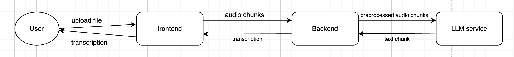
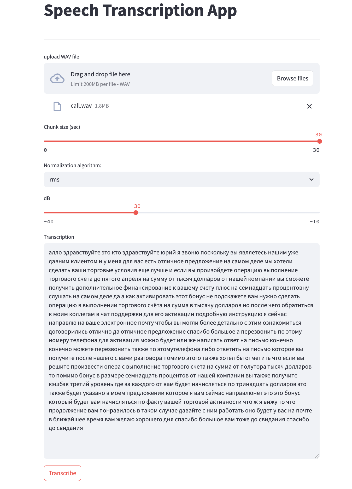

# speech_transcription

# Для простого запуска

**Важно: Сервис запускается на CPU, поэтому может работать медленно.**

**Важно: Первый раз кластер может подниматься медленней последующих запусков, так как выгружается модель с huggingface.**

Из папки с проектом вызовите
```
make full_start
```
После этого будет поднято 3 контейнера: бэкенд, фронтенд, llm сервис.
До фронтенда можно достучаться через
```
http://localhost:8010/
```


# Диаграмма



# Пример



# Описание блоков

Каждый блок - отдельный сервис, обернутый в docker-контейнер.
Для сервисом созданы кастомные dockerfile'ы c определенной логикой внутри.

### Frontend
Приложение на streamlit. Простой вариант взаимодействия с сервисами. 
Загружаем файл с компьютера. Чанки и дополнительные параметры для обработки сигнала закидываются в бэкенд.
После обработки файла, результат возвращается в виде текста.
В зависимости от метода нормализации показываются те или иные параметры.

### Backend
Прослойка между локальной LLM и фронтендом. Внутри может быть определена различная лоигка пре и постпроцессинга запросов.
На текущий момент, внутри сервис на fastAPI, который принимает части сигнала с фронтенда. Делает нормализацию и ресемплинг.
Затем сигнал также чанками передаются в LLM сервис.
Запуск происходит через uvicorn.

### LLM service
Сервис на fastAPI, который отвечает за распознавание речи. Взаимодействует с локальной LLM, которая задается через .env файл.
Запуск происходит через uvicorn.


# Запуск сервисов

Для простого запуска есть makefile. В нем следующие команды:

```
make update_env_file - копирует содержимое из .env.example в .env
```

```
make build_base_image - создает базовый образ, который используется для всех остальных сервисов
```

```
make build_torch_image - создает образ с torch
```

```
make build_frontend_image - создает образ с фронтендом
```

```
make build_backend_image - создает образ с бэкендом
```

```
make build_llm_image - создает образ с локальной LLM и сервисом для нее
```

```
make drop_images - удаляет все образы, которые были созданы
```

```
make clean - чистка кэшей и всего другого в docker
```

```
make build_images - создает все образы, которые нужны для работы
```

```
make up - запускает все сервисы через docker-compose
```

```
make down - остановка всех сервисов через docker-compose
```

```
make full_stop - остановка всех сервисов и удаление всех образов через docker-compose
```

```
make full_start - создание нужных образов и запуск всех сервисов через docker-compose
```

```
make full_restart - вызов full_stop, а затем full_start
```


# Используемые технологии
1. python
2. fastapi
3. docker
4. docker-compose
5. streamlit
6. transformers
7. make and bash scripts

# Информация по папкам и файлам в репозитории

1. artefacts - папка с картинками, что встроены в readme
2. data - папка с кэшем. Подгружается внутри docker-контейнера. Туда выгружается модель LLM
3. deploy - папка с dockerfile образами для сервисов
4. runners - папка с bash-файлами для запуска сервисов
5. src - папка с кодом для сервисов
6. req_backend.txt / req_frontend.txt / req_llm.txt - зависимости для каждого из сервисов
7. env.example - пример .env файла, который нужно создать в корне проекта
8. env - файл с переменными окружения, который используется для запуска сервисов 
9. docker-compose.yaml - файл с конфигурацией для docker-compose 
10. Makefile - файл с командами для запуска сервисов 
11. README.md - файл с описанием проекта 
12. .gitignore - файл с игнорируемыми файлами и папками

# Дополнительная информация:

Порты сервисов проброшены на локальную машину, поэтому можно с ними взаимодействовать независимо от общего кластера.


# Развитие
1. Добавить базу данных:
   * логировать транскрипцию.
   * не запускать процесс на те файлы, что уже были преобразованы.
2. Запуск сервиса на GPU для ускорения процесса.
3. Постпроцессинг исходной информации, так как сейчас это сырой текст без знаков применения.
4. Попробовать другие модели. Я попробовал 4-5 моделей. mitchelldehaven/whisper-medium-ru выдавала лучший результат в плане полноты, скорости, качества текста.
5. Добавить тесты для проверки работоспособности сервисов.
6. Асинхронная пересылка.
7. Кэш для пользователей на основе, например, Redis.
